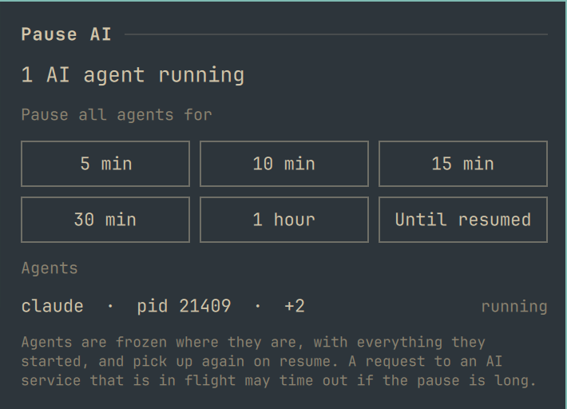
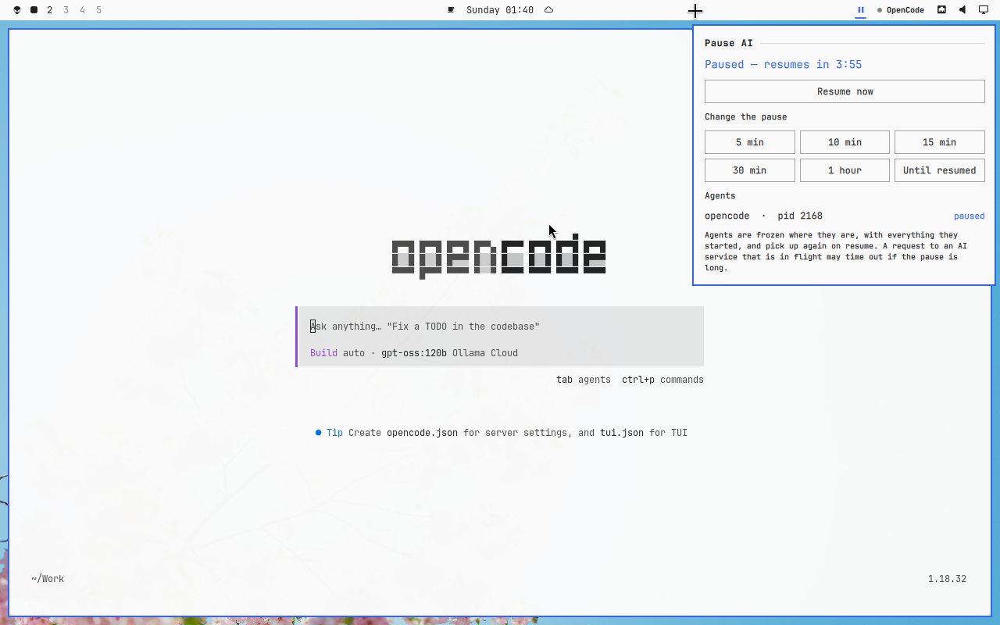

# Pause AI

An Omarchy bar button that freezes every AI agent CLI on your machine
(Claude Code, Codex, Gemini CLI, OpenCode, Cursor Agent, Crush, Aider,
Goose, Amp, Qwen Code, Copilot CLI) and resumes them exactly where they were.



- **Left click** pauses all agents until you click again.
- **Right click** opens a panel: pause for 5, 10, 15 or 30 minutes, an hour,
  or until resumed; resume now; and the agents it can see.

While paused the icon turns into a pause sign and the tooltip counts down.
Agents that start during a pause are frozen too, within a few seconds.

## Example: pausing OpenCode for five minutes



OpenCode is running in a terminal. To step away without it carrying on:

1. **Right click** the sparkle icon in the bar and choose **5 min**.
2. The icon turns into a pause sign. OpenCode, and anything it had started,
   stops where it is: no more tool calls, no more requests to the model.
3. Right click again to see the countdown (*Paused — resumes in 3:55*), the
   agent listed as **paused**, and the choice to **Resume now** or change the
   pause.
4. When the time is up, or on **Resume now**, OpenCode carries on from exactly
   the same point, still in the foreground of its terminal.

A left click does the same without a time limit: click once to pause, again
to resume. The same pause from a script or a key binding:

```bash
omarchy-shell nzkritik.pause-ai pause 5    # minutes; 0 = until resumed
omarchy-shell nzkritik.pause-ai status     # {"paused":true,"until":…,"remaining":235,…}
omarchy-shell nzkritik.pause-ai resume
```

## How it works

Pausing sends `SIGSTOP` to each agent **and everything it started** (shells,
builds, MCP servers), so nothing it set in motion carries on without it.
Resuming sends `SIGCONT` to exactly those processes and nothing else.

- An agent started from an interactive shell has that shell frozen first and
  thawed last. Otherwise the shell would see its foreground job stop, print
  `Stopped` and take the terminal back, leaving the agent stuck in the
  background after the resume.
- Processes that were already stopped (Ctrl-Z, a debugger) are never
  recorded, so a resume cannot wake them.
- Every frozen process is recorded with its start time, so a recycled
  process id is never woken by mistake.
- The pause survives a shell restart: the state lives in
  `/run/user/<uid>/nzkritik.pause-ai/`, and a timed pause whose time ran out
  meanwhile ends as soon as the shell is back.
- Only your own processes are touched. Nothing runs with elevated
  privileges, so system services (for example the `ollama` system service)
  are out of reach by design.

A paused agent keeps its full state. A request to an AI service that was in
flight may time out if the pause is long; agents generally retry.

## Requirements

Omarchy with the Quickshell bar, and `python3` (in Omarchy's base install).

## Install

```bash
omarchy plugin add https://github.com/nzkritik/omarchy-pause-ai --enable
```

That puts the Pause AI button on the bar. To place it elsewhere, use
`omarchy bar move nzkritik.pause-ai --section <left|center|right>`.

## Remove

Resume anything that is paused first, then remove the plugin:

```bash
omarchy-shell nzkritik.pause-ai resume
omarchy plugin remove nzkritik.pause-ai
```

## Settings

**Extra agent commands**: more command names to treat as agents,
space-separated (for example a wrapper script you run agents through).

## Scripting

```bash
omarchy-shell nzkritik.pause-ai pause 15     # minutes; 0 = until resumed
omarchy-shell nzkritik.pause-ai resume
omarchy-shell nzkritik.pause-ai status
```

`bin/pause-ai` also works on its own (`scan`, `pause [--until EPOCH]`,
`resume`, `status`), which is handy from a keybinding or a script.

## Tests

```bash
python3 -m unittest discover -s tests
```

The tests run a fake agent as the foreground job of a real interactive
shell and check the whole freeze/thaw cycle, including that the shell never
reports it stopped.

## License

MIT
